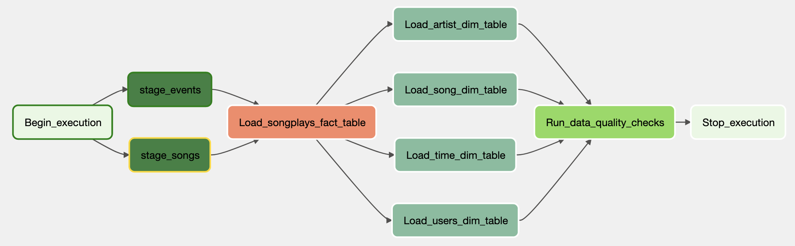

# Airflow AWS ETL Pipelines



### Table of Contents
- How to run the code
- Introduction to this project
- Database schema design and ETL process
- Data analysis

### How to run the code

You can use docker-compose to spin up airflow. Follow the instructions on airflow docs: https://airflow.apache.org/docs/apache-airflow/stable/start/docker.html

```bash
git clone git@github.com:davidkuda/airflow_data_pipelines.git
cd airflow_data_pipelines
docker-compose up airflow-init
docker-compose up
```

Once airflow is running, make sure to set the following variables. They are required and you will get errors if you do not upload them.

```bash
./airflow.sh variables set AWS_ACCESS_KEY_ID str
./airflow.sh variables set AWS_SECRET_ACCESS_KEY str
```

Optionally, you can set these two variables, too, note that they will be set in the dag "2_airflow_cli.py":

```bash
./airflow.sh variables set REDSHIFT_URL str
./airflow.sh variables set DWH_ROLE_ARN str
```

You will find 5 dags:
1. create_infrastructure -> create a redshift cluster
2. airflow_cli -> setup config such as variables
3. create_tables -> Create the tables in redshift
4. sparkify_etl -> The ETL Pipeline
5. destroy_infrastructure -> Once you are done working, you can just trigger this dag and your aws infrastructure will be destroyed. 


### Introduction: Sparkify Audio Streaming, User Data and AWS.

Sparkify is a (fictional) startup that offers music streaming services. They accumulate data but do not yet leverage them. 

In this project I build an ETL pipeline that loads data from S3 to Redshift. The pipeline is executed with airflow.

In order to perform the ETL process, I connect to the S3 bucket using Python and boto3. I then copy all json files that are stored in that bucket to AWS Redshift.The data first lands to a staging table. From there the ETL processes transform the data by using SQL to SQL design in Redshift. 

With the data model and the Sparkify will have the ability to perform several analyses.
For instance, Sparkify will gain the ability to understand which songs are being played
the most, which OS and browser their users use or how the distribution between free
and paid users is.

Now that we have learned more about Sparkify and the purpose of this project, 
I will present more details about the data in the next chapter.

### Database Schema Design and ETL Process

The data is stored as json files in AWS S3. The buckets are:

- Song data: `s3://udacity-dend/song_data`
- Log data: `s3://udacity-dend/log_data`

The first ETL step is to copy all these files into Redshift. Here is the data model for the two staging tables:


The next steps of the ETL is to distribute these columns into their respective dimensions tables. 

__events data:__
- users
- time

__song data:__
- artists
- songs


In the center of the dimension table will be the facts table. together, these form
a star schema.

#### The Facts Table "Songplays" and the Star Schema

The `songplays` table is in the center of the four dimension tables. It gets its
data from the original `log_data` as well as the `user_id` from the `users` and the 
`artist_id` from the `artists` table. The `songplays` table references every dimension 
table with a corresponding foreign key. The following diagram shows the relation
of every column of the facts table:


#### Rationale and Data Analysis

With the facts table, sparkify has now many uses for business analysis. Here are some questions that can
be answered now:

- At what hours of the day are the most songplays?
- What artists are being played the most?
- What browser / operating system are being used?
- What is the distribution between free and paid users?

Let's look at the analysis of these questions.


_Most listeners are active around afternoon to evening._


_The top three most played artists are: 1 Muse, 2 Radiohead, 3 Coldplay._


_Apparently most users listen on MacOS._


_There are way more paid users listening on Sparkify then free users._
